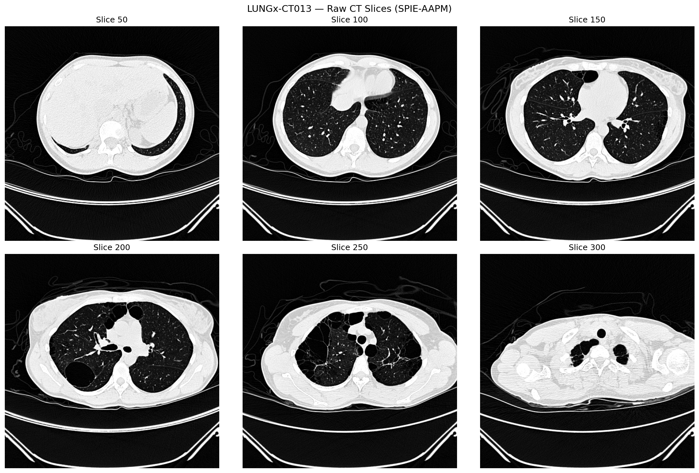
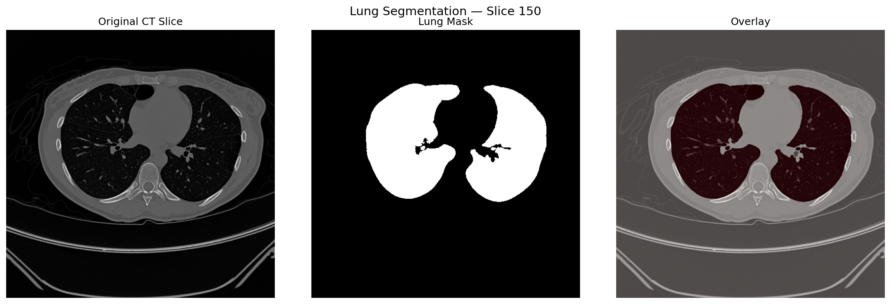
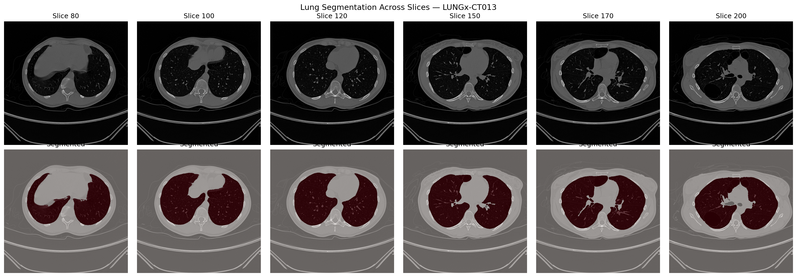
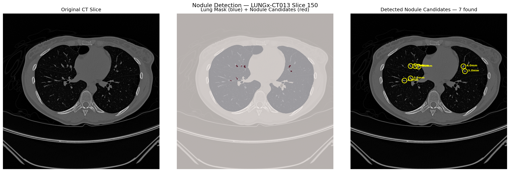

# Lung CT Segmentation Pipeline

Medical image processing pipeline for automated lung segmentation 
using real clinical CT data from the SPIE-AAPM Lung CT Challenge dataset.

## 📚 Learning Resources

**New to Python or this codebase?** Check out the comprehensive tutorial:  
👉 **[PYTHON_TUTORIAL.md](PYTHON_TUTORIAL.md)** — Learn Python syntax and understand every line of this code!

## What This Does

- Loads a full CT scan series from DICOM files (324 slices, 512×512)
- Converts raw pixel values to Hounsfield Units (HU)
- Applies lung windowing to isolate relevant tissue density ranges
- Segments both lungs automatically using body masking and morphological operations
- Visualises results with overlay across multiple slices

## Results

## Dataset

SPIE-AAPM Lung CT Challenge — 70 patients, publicly available via 
The Cancer Imaging Archive (TCIA). Data not included in this repo.

## Tech Stack

- Python 3
- pydicom — DICOM file loading
- NumPy — array operations and HU conversion
- scikit-image — connected component labelling, morphological operations
- SciPy — binary hole filling
- Matplotlib — visualisation

## How to Run

1. Download the SPIE-AAPM dataset from cancerimagingarchive.net
2. Place one patient folder in `data/`
3. Install dependencies: `pip install pydicom numpy matplotlib scipy scikit-image`
4. Open `notebooks/01_explore_data.ipynb` and run all cells

## Key Technical Challenge

DICOM pixel arrays are stored as uint16 (unsigned) which cannot hold 
negative values. Converting to int32 before applying the HU formula 
(HU = pixel × slope + intercept) is critical — without this, 
values wrap around to millions instead of the correct -1024 to +1950 range.

## Nodule Detection

Automated detection of nodule candidates inside segmented lung regions.

- Identifies dense regions (HU > -100) inside the lung mask
- Filters by size to remove noise and large vessels  
- Estimates diameter in millimetres for each candidate
- Annotates each finding with circle and measurement label

### Example Output — LUNGx-CT013 Slice 150
7 nodule candidates detected, diameters ranging from 2.3mm to 4.3mm

## Author

Keerthivarman Kanagaraj  
MSc Engineering Physics — University of Oldenburg, Germany
